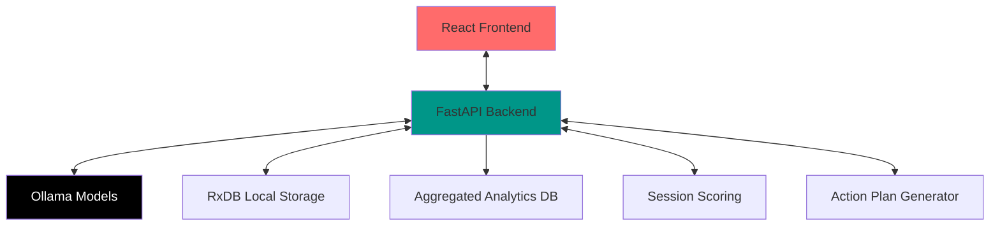

  

# Umatter

A trauma-aware wellbeing chatbot API that empowers users to offload, reflect, and take action through empathetic AI conversations.

## Tech Stack

```mermaid
graph TB
    A[FastAPI Backend] <--> B[Ollama Models]
    A <--> C[RxDB Local Storage]
    A --> D[Aggregated Analytics DB]
    E[React Frontend] <--> A
    A <--> G[Session Scoring]
    A <--> H[Action Plan Generator]
    
    style A fill:#009688
    style E fill:#FF6B6B
    style B fill:#000000,color:#fff
```
